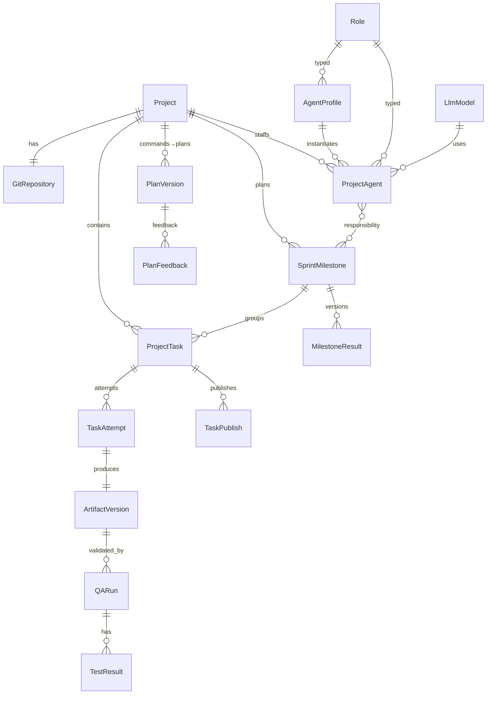

# U1 backend-pm — Domain Entities

> Stage: CONSTRUCTION / Functional Design · Unit: backend-pm · Date: 2026-09-08
> Source of truth (Q1): `01` §4.2 ERD + `06` §3.1 supplemental execution fields, adopted verbatim. This document consolidates the entities owned by U1 with their fields, relationships, and the JSON/DB conventions. Storage conventions per `06` §1: DB snake_case, JSON camelCase, enums UPPER_SNAKE_CASE, UUID→TEXT, BOOLEAN→INTEGER 0/1, DATETIME→ISO 8601 TEXT, arrays/JSON→TEXT.

## Entity Groups

### A. PM management (from `01` §4.2)
| Entity | Key fields | Relationships |
|---|---|---|
| **Project** | id, name, description, project_type, budget_level(HIGH/MEDIUM/LOW), budget_amount, project_size(SMALL/MEDIUM/LARGE), desired_agent_count, recommended_agent_count, max_agent_count, status(DRAFT/AGENT_MATCHING/READY/ACTIVE/COMPLETED/ARCHIVED), completed_at?, created_by?, created_at, updated_at **+06**: revision, active_plan_id?, active_plan_version? | 1–1 GitRepository; 1–N ProjectAgent/SprintMilestone/ProjectTask |
| **GitRepository** | id, project_id(unique), provider(GITHUB), repository_url, default_branch, access_scope, created_at, updated_at | 1–1 Project |
| **Role** | id, code(unique), name, description, is_required_for_project(0/1), timestamps | 1–N AgentProfile/ProjectAgent/RoleDocumentTemplate |
| **LlmModel** | id, provider, model_name, display_name, grade(BASIC/STANDARD/ADVANCED), is_active(0/1), timestamps; unique(provider,model_name) | 1–N AgentProfile/ProjectAgent |
| **AgentProfile** | id, name, role_id, default_llm_model_id, skill_level(JUNIOR/MID/SENIOR), description?, default_md_template?, default_color?, default_icon_key?, is_active(0/1), timestamps | N–1 Role/LlmModel; 1–N ProjectAgent |
| **ProjectAgent** | id, project_id, agent_profile_id, role_id, llm_model_id, display_name, display_color(#hex), icon_key, assignment_reason?, status(ASSIGNED/IDLE/WORKING/WAITING/BLOCKED/REMOVED), is_primary_pm(0/1), timestamps; unique(project_id,agent_profile_id); partial-unique primary PM **+06**: current_task_id?, next_task_id?, activity_summary? | N–1 Project/AgentProfile/Role/LlmModel; N–N SprintMilestone |
| **RoleDocumentTemplate** | id, role_id, file_name, description?, is_required(0/1), timestamps | N–1 Role |
| **ProjectAgentDocument** | id, project_agent_id, project_id, role_document_template_id?, file_path(unique per project), document_type?, status(PLANNED/CREATED/UPDATED/ARCHIVED), timestamps | N–1 ProjectAgent/Project |
| **SprintMilestone** | id, project_id, title, role_id?, display_color?, sort_order, timestamps; **status/progress are DERIVED read-only** (PLANNED/IN_PROGRESS/DONE/BLOCKED; progressCurrent/Total/Percent) | 1–N ProjectTask; N–N ProjectAgent |
| **ProjectAgentMilestone** | id, project_id, project_agent_id, sprint_milestone_id, responsibility_type(OWNER/CONTRIBUTOR/REVIEWER), timestamps; unique(agent,milestone,type) | link |
| **ProjectTask** | id, project_id, sprint_milestone_id?, assigned_project_agent_id?, role_id?, title, description?, status(TODO/RUNNING/WAITING/BLOCKED/REVIEW/COMPLETED/FAILED/CANCELLED), execution_mode?(AI_AGENT/HUMAN/MIXED), priority(LOW/MEDIUM/HIGH/CRITICAL), sort_order, timestamps **+06**: requirement_ids[], dependency_task_ids[], approved_plan_id?, approved_plan_version?, current_attempt_id?, wait_reasons[], revision | N–1 Project/Milestone/ProjectAgent/Role |

### B. Orchestration execution (from `06` §3.1)
| Entity | Key fields |
|---|---|
| **PlanVersion** | id, project_id, version, request, steps, agents, scope, dependencies, validation, impact, status(REVIEW/FINAL_APPROVAL_PENDING/APPROVED_WAITING/EXECUTING/COMPLETED/SUPERSEDED) |
| **PlanFeedback** | id, plan_id, plan_version, text, created_at |
| **Decision** | id, scope_task_ids[], reason, options, selected_answer?, status(OPEN/RESOLVED), resolved_at? |
| **Approval** | id, kind(PLAN_EXECUTION/MILESTONE_RESULT), target_id, target_version, status, actor, request_id |
| **TaskAttempt** | id, task_id, sequence, artifact_version, started_at, ended_at?, failure_reason? |
| **ArtifactVersion** | id, task_id, attempt_id, version, generation_status(GENERATING/GENERATED/FAILED), file_paths[], base_commit_sha, content_hash |
| **QARun** | id, project_id, target_artifact_version, target_hash, scope, results, evidence, started_at, ended_at?, run_status(QUEUED/RUNNING/COMPLETED/ERROR), technical_gate(PENDING/PASSED/FAILED/ERROR), report_artifact_id? |
| **TestResult** | id, qa_run_id, name, result(PASS/FAIL/SKIPPED), evidence? |
| **MilestoneResult** | id, milestone_id, version, result_hash, task/artifact/qa_run/commit snapshot, review_status(NOT_REQUIRED/PENDING/APPROVED/REVISION_REQUESTED/REJECTED), additional_validation(UNANSWERED/NONE/REQUESTED), created_at |

### C. Platform / common (from `06` §3.1)
| Entity | Key fields |
|---|---|
| **ActivityEvent** | id, project_id, revision, type, entity_id, payload, occurred_at |
| **CommandReceipt** | request_id, payload_hash, operation, accepted, result?, error?; enforces idempotency |
| **TaskPublish** (written by U2, modeled here) | task_id, attempt_id, artifact_version, request_id, status(NOT_STARTED/NO_CHANGES/COMMITTED_LOCAL/PUSHED/FAILED/SYNC_REQUIRED), commit_sha?, branch_url?, error? |

## Relationship Diagram

## Notes
- Arrays (`requirement_ids`, `dependency_task_ids`, `wait_reasons`, `file_paths`) stored as JSON TEXT (MVP).
- `wait_reasons[]` values: DEPENDENCY, DECISION, PLAN_APPROVAL, MILESTONE_APPROVAL, ADDITIONAL_VALIDATION, PROJECT_WRITE_LOCK (+ reference id).
- Milestone `status`/progress are **never stored** — derived from child tasks (see business-logic-model.md).
- All cross-entity references validated for **same-project** membership; cross-project links rejected.
