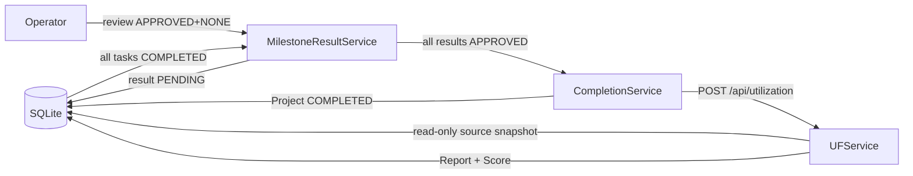
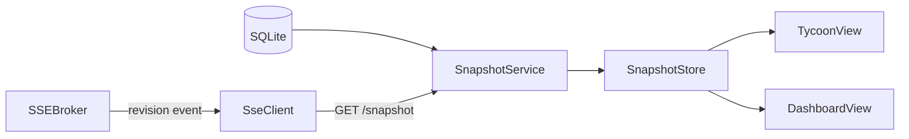

# Application Design — Component Dependencies

> Stage: INCEPTION / Application Design · Date: 2026-09-08
> Dependency matrix, communication patterns, and data-flow diagrams.

## Dependency Matrix (row depends on column)

| ↓ depends on → | PM | Planning | Decision | Approval | Scheduler | Worker | QAGate | Publish | MilestoneResult | Completion | Git | UF | Provider | Common |
|---|---|---|---|---|---|---|---|---|---|---|---|---|---|---|
| **PMService** | — | | | | | | | | | | | | | ✅ rev/activity |
| **PlanningService** | ✅ team/reqs | — | | ✅ | | | | | | | | | | ✅ |
| **DecisionService** | | | — | | | | | | | | | | | ✅ |
| **ApprovalService** | | | | — | | | | | | | | | | ✅ |
| **SchedulerService** | ✅ tasks/deps | ✅ approved plan | ✅ | ✅ | — | ✅ enqueue | | | | | ✅ lock | | | ✅ |
| **ExecutionWorker** | ✅ task/agent | | | | | — | | | | | ✅ apply | | ✅ execute | ✅ |
| **QAGateService** | | | | | | ✅ artifact | — | | | | | | | ✅ |
| **PublishCoordinator** | ✅ task | ✅ planVer | | ✅ | | | ✅ gate | — | | | ✅ push | | | ✅ |
| **MilestoneResultService** | ✅ tasks | ✅ (revision plan) | | ✅ | | | ✅ qa | ✅ commit | — | ✅ | | | | ✅ |
| **CompletionService** | ✅ project | | | | | | | | ✅ | — | | ✅ trigger | | ✅ |
| **GitInterface** | ✅ repo cfg | | | | | | | | | | — | | | (env creds) |
| **UFService** | ✅ read-only | | | | | | ✅ read | ✅ read | ✅ read | | | — | | ✅ |
| **Routers (HTTP)** | ✅ | ✅ | ✅ | ✅ | ✅ | ✅ | ✅ | ✅ | ✅ | | ✅ | ✅ | | ✅ |

Rules: PM never depends on execution services. UF depends **read-only** on PM/orchestrator/QA/git. Orchestrator is the hub. Common (revision/activity/receipts/snapshot/SSE) is a leaf dependency of everything mutating.

## Frontend dependency

```
AppShell ──mounts──> GlobalExecutiveBar (shared)
   ├── TycoonView ─────┐
   ├── DashboardView ──┼──> SnapshotStore (single source of truth)
   └── FeedbackSection ┘         ▲          │
                                 │          └── selectors
                        ApiClient│          SseClient (drives re-read)
                                 ▼
                          Backend HTTP + SSE
```
- Both views depend only on `SnapshotStore` for business state; they never compute/store business state independently.
- `tycoon-item-selected` CustomEvent flows Scene → DOM for **selection** only.

## Communication Patterns
- **HTTP (command/query)**: Frontend → Routers → Services. Commands carry `requestId`; versioned commands carry `expectedVersion`/`expectedRevision`. Async accept → 202 + commandId; final result via snapshot/SSE.
- **SSE (invalidation)**: Backend SSEBroker → SseClient. Payload = `project.updated{revision,type,entityId}`; client re-reads `/snapshot`. Heartbeat 15s.
- **In-process events/queue**: Services → ExecutionWorker via persisted command/job queue; write-lock per project serializes writes.
- **Subprocess**: GitInterface → `git` CLI (arg arrays, no shell), cwd = project checkout.
- **External API**: OpenAIExecutionProvider → OpenAI (timeouts + graceful degradation to fixture per NFR-7).
- **CustomEvent (DOM)**: Scene → HUD selection only.

## Data-Flow Diagrams

### DF-1 · Command → Plan → Execute → Publish
```mermaid
flowchart LR
  U[Operator] -->|POST /commands (requestId)| R[Routers]
  R --> P[PlanningService]
  P -->|Plan REVIEW| DB[(SQLite)]
  U -->|feedback/review-complete/approve| P
  P -->|approved version| S[Scheduler]
  S -->|lock + enqueue| W[ExecutionWorker]
  W --> XP[ExecutionProvider]
  W --> G[GitInterface apply]
  W --> Q[QAGateService]
  Q -->|gate PASSED| PUB[PublishCoordinator]
  PUB -->|validate + push| G
  PUB -->|COMPLETED| DB
  DB --> REV[Revision+Activity]
  REV --> SSE[SSEBroker]
  SSE -->|project.updated| FE[SnapshotStore]
```

### DF-2 · Milestone result → project completion → UF


### DF-3 · Realtime sync (two tabs)


## Consistency Invariants (design-level)
- One transaction writes state + bumps revision + appends activity; SSE emitted after commit.
- No merged status axes (execution / artifact-gen / milestone-review / plan / QA / connection kept separate).
- Task COMPLETED requires approvedPlanVersion + technical gate PASSED + push success + executionMode.
- Idempotent commands (requestId) and optimistic concurrency (409) everywhere mutating.
- Per-project write-lock held across change→QA→publish; reads/plans not blocked.
