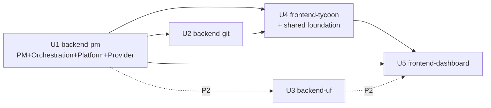

# Units of Work — Dependency Matrix & Build Order

> Stage: INCEPTION / Units Generation · Date: 2026-09-08
> 5 units (modular monolith). Backend units integrate via in-process Python calls (Q3); frontend units consume the `06` HTTP+SSE contract; frontend↔backend is the only network boundary.

## Dependency Matrix (row depends on column)

| ↓ depends on → | U1 backend-pm | U2 backend-git | U3 backend-uf | U4 frontend-tycoon | U5 frontend-dashboard |
|---|---|---|---|---|---|
| **U1 backend-pm** | — | ✅ publish (PublishCoordinator → GitInterface) | ✅ trigger `POST /api/utilization` on completion | — | — |
| **U2 backend-git** | ✅ reads repo config + validated publish preconditions from U1 | — | — | — | — |
| **U3 backend-uf** | ✅ read-only completed-revision source snapshot from U1 | (reads commit SHAs surfaced via U1) | — | — | — |
| **U4 frontend-tycoon** | ✅ HTTP+SSE contract (snapshot/events) | — | — | — | — |
| **U5 frontend-dashboard** | ✅ HTTP+SSE contract | — | ✅ `/api/utilization*` | ✅ shared foundation (AppShell/store/ApiClient/SseClient/UI) | — |

Notes:
- **U1 is the hub**. U2 and U3 are leaf backend concerns invoked/triggered by U1; they don't call each other.
- **U4 owns the shared frontend foundation** (Q7=B); **U5 depends on U4** for shell/store/clients/UI, plus U1 and U3 contracts.
- No cycles: U2→U1 and U1→U2 are complementary (U1 orchestrates, U2 executes git under U1's validation) but at the **method level** it is a one-way call U1→U2 (GitInterface) with U2 reading config passed in — no runtime import cycle. UF is strictly downstream/read-only.

## Communication
- **Backend↔backend**: in-process function calls (U1→U2 GitInterface; U1→U3 report trigger; U3→U1 read-only snapshot access).
- **Frontend↔backend**: HTTP commands (requestId, expectedVersion/Revision) + SSE snapshot-invalidation.
- **Frontend↔frontend**: U5 imports U4's shared foundation modules (compile-time dependency within the single SPA).
- **External**: U1 execution provider → OpenAI (optional, timeouts + fixture fallback); U2 → `git` CLI subprocess.

## Build / Construction Order (Q4: P1 connected-flow first)

**P1 (connected flow)**: U1 → U2 → U4 → U5 (enough to demo staffing → plan → approve → execute → QA → real push → milestone review, across both views).
**Then P2**: U3 (UF) + fold-in stories (PM-6, ORCH-8, UF-3/4, DASH-4, RT-2).

Rationale: U1 unblocks everything (data model, orchestration, snapshot/SSE, execution). U2 is required before a Task can reach COMPLETED (publish precondition). U4 establishes the shared frontend foundation that U5 needs. U3 (UF) only matters after a project can complete, so it is deferred to P2.

## Per-unit CONSTRUCTION note (Q5)
NFR Requirements/NFR Design run **once at the system level** (the cross-cutting contract is fixed in `06`) and are referenced by each unit; Functional Design + Code Generation + Build&Test run per unit in the order above.
