# Execution Plan — CompanyOps

> Stage: INCEPTION / Workflow Planning · Date: 2026-09-08 · Project type: Greenfield
> Inputs loaded: requirements.md, requirement-verification-questions.md (answered), resiliency-clarification-questions.md (answered), stories.md, personas.md.

## Detailed Analysis Summary

### Change Impact Assessment
- **User-facing changes**: **Yes** — an entirely new UI: shared GlobalExecutiveBar, Tycoon Office (R3F/Three.js 2.5D), Dashboard control center, UF feedback section.
- **Structural changes**: **Yes** — net-new architecture: monorepo (`backend/` FastAPI + `frontend/` React/Vite), server-side orchestrator + task worker, SSE transport, Git integration layer, optional LLM adapter.
- **Data model changes**: **Yes** — full new SQLite schema (Project, AgentProfile, ProjectAgent, SprintMilestone, ProjectTask, UtilizationReport, UtilizationMetric, Feedback, plus plan/decision/publish state).
- **API changes**: **Yes** — new HTTP contract (`/snapshot`, `/events`, `/commands`, `/plans`, `/decisions`, `/tasks/{id}/publish`, `/api/projects*`, `/api/utilization*`, `/api/feedbacks`).
- **NFR impact**: **Yes** — real-time (SSE contract), concurrency/idempotency (409 model), performance (3D throttling), and Resiliency baseline (directional, single-node per R1=E).

### Risk Assessment
- **Risk Level**: **Medium** — broad scope and several integration points (real Git push, optional OpenAI adapter, SSE, 3D), but greenfield with trivial rollback (no production system) and a demo/fixture default that de-risks the AI path.
- **Rollback Complexity**: **Easy** — greenfield; discard/revert. Git output goes to a dedicated throwaway remote branch per project.
- **Testing Complexity**: **Moderate** — stateful plan-gated flow + real-time sync + Git side effects require integration coverage; PBT disabled (Q11=C).

## Workflow Visualization

```mermaid
flowchart TD
    Start(["User Request: Build CompanyOps"])

    subgraph INCEPTION["🔵 INCEPTION PHASE"]
        WD["Workspace Detection<br/><b>COMPLETED</b>"]
        RE["Reverse Engineering<br/><b>SKIPPED</b>"]
        RA["Requirements Analysis<br/><b>COMPLETED</b>"]
        US["User Stories<br/><b>COMPLETED</b>"]
        WP["Workflow Planning<br/><b>IN PROGRESS</b>"]
        AD["Application Design<br/><b>EXECUTE</b>"]
        UG["Units Generation<br/>(Planning + Generation)<br/><b>EXECUTE</b>"]
    end

    subgraph CONSTRUCTION["🟢 CONSTRUCTION PHASE"]
        FD["Functional Design<br/><b>EXECUTE</b>"]
        NFRA["NFR Requirements<br/><b>EXECUTE</b>"]
        NFRD["NFR Design<br/><b>EXECUTE</b>"]
        ID["Infrastructure Design<br/><b>SKIP</b>"]
        CG["Code Generation<br/>(Planning + Generation)<br/><b>EXECUTE</b>"]
        BT["Build and Test<br/><b>EXECUTE</b>"]
    end

    subgraph OPERATIONS["🟡 OPERATIONS PHASE"]
        OPS["Operations<br/><b>PLACEHOLDER</b>"]
    end

    Start --> WD
    WD --> RE
    RE --> RA
    RA --> US
    US --> WP
    WP --> AD
    AD --> UG
    UG --> FD
    FD --> NFRA
    NFRA --> NFRD
    NFRD --> ID
    ID --> CG
    CG --> BT
    BT --> OPS
    OPS --> End(["Complete"])

    style WD fill:#4CAF50,stroke:#1B5E20,stroke-width:3px,color:#fff
    style RA fill:#4CAF50,stroke:#1B5E20,stroke-width:3px,color:#fff
    style US fill:#4CAF50,stroke:#1B5E20,stroke-width:3px,color:#fff
    style WP fill:#4CAF50,stroke:#1B5E20,stroke-width:3px,color:#fff
    style CG fill:#4CAF50,stroke:#1B5E20,stroke-width:3px,color:#fff
    style BT fill:#4CAF50,stroke:#1B5E20,stroke-width:3px,color:#fff
    style RE fill:#BDBDBD,stroke:#424242,stroke-width:2px,stroke-dasharray: 5 5,color:#000
    style ID fill:#BDBDBD,stroke:#424242,stroke-width:2px,stroke-dasharray: 5 5,color:#000
    style AD fill:#FFA726,stroke:#E65100,stroke-width:3px,stroke-dasharray: 5 5,color:#000
    style UG fill:#FFA726,stroke:#E65100,stroke-width:3px,stroke-dasharray: 5 5,color:#000
    style FD fill:#FFA726,stroke:#E65100,stroke-width:3px,stroke-dasharray: 5 5,color:#000
    style NFRA fill:#FFA726,stroke:#E65100,stroke-width:3px,stroke-dasharray: 5 5,color:#000
    style NFRD fill:#FFA726,stroke:#E65100,stroke-width:3px,stroke-dasharray: 5 5,color:#000
    style OPS fill:#FFF59D,stroke:#F57F17,stroke-width:2px,color:#000
    style Start fill:#CE93D8,stroke:#6A1B9A,stroke-width:3px,color:#000
    style End fill:#CE93D8,stroke:#6A1B9A,stroke-width:3px,color:#000

    linkStyle default stroke:#333,stroke-width:2px
```

## Phases to Execute

### 🔵 INCEPTION PHASE
- [x] Workspace Detection (COMPLETED)
- [x] Reverse Engineering (SKIPPED — greenfield, no existing code)
- [x] Requirements Analysis (COMPLETED)
- [x] User Stories (COMPLETED — 24 stories / 7 epics)
- [x] Execution Plan (IN PROGRESS)
- [ ] Application Design - **EXECUTE**
  - **Rationale**: Net-new system with many components/services (orchestrator, task worker, 5 feature modules, Git/LLM adapters). Component methods, business rules (plan-first gating, multi-axis state, progress math), and service-layer boundaries must be defined.
- [ ] Units Generation - **EXECUTE**
  - **Rationale**: New data models/schema, many new endpoints, non-trivial state management, and multiple modules. The system must be partitioned into buildable units before Construction.

### 🟢 CONSTRUCTION PHASE (per-unit, conditional)
- [ ] Functional Design - **EXECUTE**
  - **Rationale**: Each unit needs its functional behavior, interfaces, and business rules specified before code generation (e.g., plan/decision lifecycle, publish idempotency, score computation).
- [ ] NFR Requirements - **EXECUTE**
  - **Rationale**: Real-time (SSE), concurrency/idempotency, performance (3D throttling), and the enabled Resiliency baseline generate concrete NFRs to capture per unit.
- [ ] NFR Design - **EXECUTE**
  - **Rationale**: Design how the NFRs are met AND resolve the resiliency decision points deferred here: RESILIENCY-03 (change mgmt), RESILIENCY-04 (CI/CD, rollback, deployment style), RESILIENCY-08 (regional topology — expected single-region per R1=E), RESILIENCY-14 (resiliency testing), RESILIENCY-15 (incident response).
- [ ] Infrastructure Design - **SKIP**
  - **Rationale**: Single-node local PoC (R1=E) with SQLite and a single FastAPI process; no cloud provisioning or IaC in scope. Local run/build setup is covered by NFR Design + Code Generation (monorepo scripts, venv/requirements, .env for OpenAI + git credentials). Can be added later if a cloud deploy target is introduced.
- [ ] Code Generation - **EXECUTE (ALWAYS)**
  - **Rationale**: Implementation planning + code generation for backend + frontend.
- [ ] Build and Test - **EXECUTE (ALWAYS)**
  - **Rationale**: Build, run, and verify the connected flow; standard tests (PBT disabled per Q11=C).

### 🟡 OPERATIONS PHASE
- [ ] Operations - PLACEHOLDER
  - **Rationale**: Future deployment/monitoring workflows; out of scope for this build.

## Module Build Sequence (Greenfield guidance)
Ordered to realize the **P1 connected flow first** (Q4=C), then fold in P2:
1. **Platform/shared foundation** — monorepo scaffold, SQLite schema + SQLAlchemy models, snapshot/SSE plumbing, AppShell + GlobalExecutiveBar. *(blocks everything)*
2. **PM module** — projects, agent profiles/assignment, milestones/tasks, recommendation. *(blocks orchestration)*
3. **Orchestrator + Worker** — plan-first lifecycle, execution, QA gate, executionMode; demo/fixture default + OpenAI adapter.
4. **GIT module** — publish (real push), idempotency, write-lock. *(precondition for task COMPLETED)*
5. **DASH module** — Attention Center, plan review/approval, task board.
6. **TY module** — isometric scene, selection events, HUD.
7. **UF module** — utilization report/score/feedback (post-completion).
8. **P2 fold-in** — profile edit/replace, Decisions, UF comparison/feedback UI, charts/dnd, reconnect UX.

## Estimated Timeline
- **Total stages to execute**: 4 remaining inception/construction design stages (AD, UG, FD, NFR Req, NFR Design) + Code Generation + Build and Test.
- **Estimated duration**: Hackathon-scale (~1–2 focused days) for the P1 connected flow; P2 as time allows.

## Success Criteria
- **Primary Goal**: A working CompanyOps with the P1 connected flow demonstrable end-to-end.
- **Key Deliverables**: Runnable monorepo (backend + frontend), SQLite-backed state, plan-first orchestration, real Git push to `project/{projectId}`, both views synced via SSE, utilization report on completion.
- **Quality Gates**: Approved plan version + technical QA pass + publish success + executionMode recorded before any task is COMPLETED; no merged state axes; 409 on stale version/revision; progress math exact; no blocking resiliency findings.
